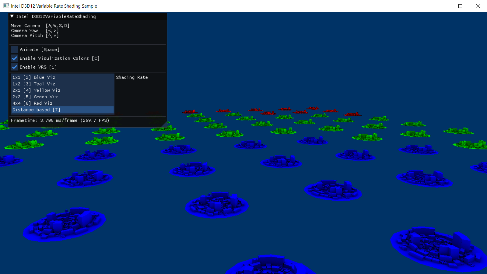

# DISCONTINUATION OF PROJECT #  
This project will no longer be maintained by Intel.  
Intel has ceased development and contributions including, but not limited to, maintenance, bug fixes, new releases, or updates, to this project.  
Intel no longer accepts patches to this project.  
 If you have an ongoing need to use this project, are interested in independently developing it, or would like to maintain patches for the open source software community, please create your own fork of this project.  
  

Demonstrate Gen11 Tier1 VRS Capabilities with DirectX 12

## Keyboard Commands
* W,A,S,D: Move Camera
* <,>: Camera Yaw
* ^,v: Camera Pitch
* Space: Toggle Animation
* C: Toggle Visualization Colors
* R: Reset Camera
* 1: Toggle VRS
* 2: 1x1 Shading Rate
* 3: 1x2 Shading Rate
* 4: 2x1 Shading Rate
* 5: 2x2 Shading Rate
* 6: 4x4 Shading Rate
* 7: Distance Based Shading Rate
	
## Requirements
* Visual Studio 2017
* Windows 10 Insider Preview 19H1 Build 18334 or Greater
* Windows 10 Insider Preview 19H1 Build 18334 or Greater SDK 
* VRS Capable Windows Driver
